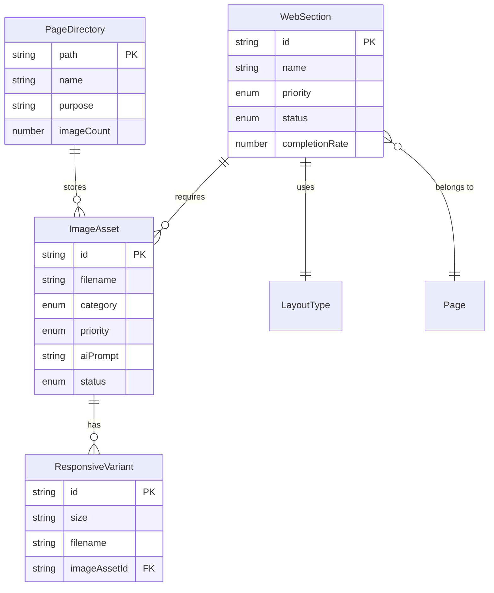

# Data Model: EIE官网原型完善与图片素材整理

**Generated**: 2025-11-04
**Phase**: Phase 1 - Design & Contracts
**Status**: Approved

---

## 📊 概述

本文档定义了 EIE 官网项目中涉及的核心实体和数据结构。虽然这是一个静态网站项目,但清晰的数据模型有助于组织图片素材、管理内容和规划未来扩展。

---

## 🎨 Entity 1: ImageAsset (图片素材)

### 实体描述
图片素材实体代表网站中使用的所有图片文件,包括照片、Logo、图标等。每个图片素材都有明确的用途、规格和优先级。

### 字段定义

| 字段名 | 类型 | 必需 | 说明 | 示例 |
|--------|------|------|------|------|
| `id` | string | ✅ | 唯一标识符,格式: `P{优先级}-{序号}` | `P0-001` |
| `filename` | string | ✅ | 文件名 (不含路径) | `hero-background.webp` |
| `category` | enum | ✅ | 分类: hero, services, partners, network, logo | `services` |
| `subcategory` | string | ❌ | 子分类 (可选) | `china-ops` |
| `purpose` | string | ✅ | 用途说明 | "Hero 区域背景图片" |
| `dimensions` | object | ✅ | 尺寸要求 | `{width: 1920, height: 1080}` |
| `aspectRatio` | string | ✅ | 宽高比 | `16:9` |
| `format` | string[] | ✅ | 文件格式 | `["webp", "jpg"]` |
| `priority` | enum | ✅ | 优先级: P0, P1, P2 | `P0` |
| `aiPrompt_en` | string | ✅ | AI 生成提示词 (英文) | "A modern air cargo..." |
| `aiPrompt_zh` | string | ✅ | AI 生成提示词 (中文) | "现代化航空货运..." |
| `status` | enum | ✅ | 状态: pending, generated, optimized, deployed | `pending` |
| `altText_en` | string | ✅ | 替代文本 (英文,用于 SEO) | "Modern air cargo loading scene" |
| `altText_zh` | string | ✅ | 替代文本 (中文) | "现代化航空货运装载场景" |
| `sizeKB` | number | ❌ | 文件大小 (KB) | 150 |
| `relatedSection` | string | ✅ | 关联的 Section ID | `S3.5-ChinaOps` |
| `variants` | object[] | ❌ | 响应式变体 | `[{size: "800w", file: "..."}, ...]` |
| `sourceURL` | string | ❌ | 原图链接 (如有) | "https://..." |
| `createdDate` | date | ❌ | 创建日期 | `2025-11-04` |
| `updatedDate` | date | ❌ | 更新日期 | `2025-11-04` |

### 验证规则

1. **文件命名规范**:
   - 小写字母和数字
   - 使用连字符分隔 (`-`)
   - 避免空格和特殊字符
   - 示例: `✅ china-ops-aircraft.webp` | `❌ China Ops Aircraft.WEBP`

2. **尺寸要求**:
   - Hero 背景: 1920x1080px (16:9)
   - 服务场景: 800x600px (4:3)
   - Logo: 矢量 SVG 或高分辨率 PNG
   - 合作伙伴 Logo: 高度 60-80px

3. **优先级分配**:
   - P0: 必须有,总数 ≤ 12 张 (关键业务展示)
   - P1: 重要,显著提升展示效果
   - P2: 可选,锦上添花

4. **AI 提示词要求**:
   - 长度: 100-300 字
   - 包含: 主题、风格、色彩、元素、构图、氛围
   - 中英文双语

5. **文件格式**:
   - 照片: WebP (主) + JPEG (备用)
   - Logo/图标: SVG (主) + PNG (备用)
   - 地图: SVG (可交互) 或 PNG

6. **文件大小限制**:
   - Hero 背景: < 200KB
   - 服务场景: < 150KB
   - Logo/图标: < 50KB
   - 合作伙伴 Logo: < 30KB

### 关系

```mermaid
ImageAsset ||--o{ WebSection : "belongs to"
ImageAsset ||--o{ PageDirectory : "stored in"
ImageAsset }o--|| ResponsiveVariant : "has"
```

- **属于 WebSection**: 一个图片属于一个或多个 Section
- **存储在 PageDirectory**: 所有图片存储在 `/page` 目录结构中
- **拥有响应式变体**: 可能有多个尺寸的变体 (800w, 1200w, 1920w)

### 示例实体

```json
{
  "id": "P0-001",
  "filename": "hero-background.webp",
  "category": "hero",
  "subcategory": null,
  "purpose": "Hero 区域背景图片,展示集装箱货轮场景",
  "dimensions": {
    "width": 1920,
    "height": 1080
  },
  "aspectRatio": "16:9",
  "format": ["webp", "jpg"],
  "priority": "P0",
  "aiPrompt_en": "A modern container ship at sea during golden hour, deep navy blue ocean #0A2647, cargo containers in blue and orange tones #FF9500, professional maritime photography, wide angle view, 16:9 aspect ratio, cinematic lighting, photorealistic, 8K quality, no text overlays",
  "aiPrompt_zh": "现代化集装箱货轮在黄金时段的海上场景,深海军蓝色海洋 #0A2647,蓝色和橙色调的货柜 #FF9500,专业海运摄影风格,广角视图,16:9 比例,电影级光影,超真实,8K 质量,无文字叠加",
  "status": "pending",
  "altText_en": "Modern container ship transporting cargo across ocean - EIE Logistics maritime services",
  "altText_zh": "现代集装箱货轮跨洋运输货物 - EIE 国际物流海运服务",
  "sizeKB": null,
  "relatedSection": "S1-Hero",
  "variants": [
    {
      "size": "800w",
      "file": "hero-background-800.webp"
    },
    {
      "size": "1200w",
      "file": "hero-background-1200.webp"
    },
    {
      "size": "1920w",
      "file": "hero-background-1920.webp"
    }
  ],
  "sourceURL": null,
  "createdDate": "2025-11-04",
  "updatedDate": "2025-11-04"
}
```

---

## 📄 Entity 2: WebSection (网站板块)

### 实体描述
WebSection 代表网站中的各个功能板块,对应 PRD 中定义的 10 个主要 section。每个 section 包含内容、布局和所需的图片素材。

### 字段定义

| 字段名 | 类型 | 必需 | 说明 | 示例 |
|--------|------|------|------|------|
| `id` | string | ✅ | Section 编号 | `S1-Hero` |
| `name_en` | string | ✅ | 板块名称 (英文) | "Hero Area" |
| `name_zh` | string | ✅ | 板块名称 (中文) | "英雄区" |
| `priority` | enum | ✅ | 重要性: P0, P1, P2 | `P0` |
| `status` | enum | ✅ | 完成状态: missing, partial, complete, tested | `partial` |
| `completionRate` | number | ✅ | 完成度 (0-100) | 90 |
| `requiredImages` | string[] | ✅ | 所需图片 ID 列表 | `["P0-001", "P1-011"]` |
| `contentStatus` | enum | ✅ | 文案状态: missing, draft, final | `final` |
| `layoutType` | enum | ✅ | 布局类型 | `hero-split` |
| `htmlElementId` | string | ✅ | HTML 中的元素 ID | `#hero-section` |
| `order` | number | ✅ | 页面中的顺序 | 1 |
| `parentPage` | enum | ✅ | 所属页面 | `home` |
| `dependencies` | string[] | ❌ | 依赖的其他 section | `[]` |
| `colorScheme` | object | ✅ | 配色方案 | `{bg: "#F8F8F8", text: "#333"}` |
| `hasAnimation` | boolean | ✅ | 是否包含动画 | true |

### 布局类型枚举

| 布局类型 | 说明 | 示例 Section |
|---------|------|-------------|
| `hero-split` | 左右分栏,左文右图 | S1-Hero |
| `banner-centered` | 居中横幅,带 Logo | S2-Partnership |
| `card-grid-2x2` | 2x2 卡片网格 | S3-WhyChoose |
| `content-media-rows` | 内容+媒体行 | S3.5-GlobalDirect |
| `timeline-horizontal` | 横向时间轴 | S4-ServiceFlow |
| `list-checkmarks` | 勾选列表 | S5-Advantages |
| `stats-grid` | 数据展示网格 | S6-Numbers |
| `feature-list` | 功能列表 | S7-Technology |
| `map-interactive` | 交互式地图 | S8-Network |
| `logo-wall` | Logo 墙 | S9-Partners |
| `cta-centered` | 居中行动号召 | S10-CTA |

### 状态流转

```
missing → design → partial → complete → tested → deployed
   ↓        ↓        ↓         ↓         ↓         ↓
 (缺失)  (设计中) (部分完成) (已完成)  (已测试)  (已部署)
```

### 示例实体

```json
{
  "id": "S3.5-GlobalDirect",
  "name_en": "Global Direct Ecommerce Solution",
  "name_zh": "全球直邮电商解决方案",
  "priority": "P0",
  "status": "partial",
  "completionRate": 75,
  "requiredImages": [
    "P0-002",  // china-ops-aircraft.webp
    "P0-003",  // china-ops-schedule.webp
    "P0-004",  // china-ops-sorting.webp
    "P0-005",  // canada-ops-customs.webp
    "P0-006",  // canada-ops-warehouse.webp
    "P0-007"   // canada-ops-delivery.webp
  ],
  "contentStatus": "final",
  "layoutType": "content-media-rows",
  "htmlElementId": "#global-direct-section",
  "order": 4,
  "parentPage": "home",
  "dependencies": [],
  "colorScheme": {
    "background": "#FFFFFF",
    "headerBg": "#BBDEFB",
    "text": "#333333"
  },
  "hasAnimation": false
}
```

---

## 📁 Entity 3: PageDirectory (页面目录结构)

### 实体描述
PageDirectory 定义了 `/page` 目录下的文件组织结构,用于存储所有图片素材。良好的目录结构便于管理和维护。

### 字段定义

| 字段名 | 类型 | 必需 | 说明 | 示例 |
|--------|------|------|------|------|
| `path` | string | ✅ | 目录路径 (相对于项目根目录) | `/page/services/china-ops` |
| `name` | string | ✅ | 目录名称 | `china-ops` |
| `purpose` | string | ✅ | 用途说明 | "中国前段物流场景图片" |
| `imageCount` | number | ❌ | 包含图片数量 | 3 |
| `totalSizeKB` | number | ❌ | 总大小 (KB) | 450 |
| `structure` | object[] | ❌ | 子目录结构 | `[{name: "subfolder", ...}]` |
| `allowedFormats` | string[] | ✅ | 允许的文件格式 | `["webp", "jpg", "png", "svg"]` |
| `maxFileSize` | number | ✅ | 单文件最大大小 (KB) | 200 |

### 目录结构设计

```
/page/                                  # 图片根目录
├── hero/                              # Hero 区域图片
│   ├── hero-background.webp           # 主背景图 (1920x1080)
│   ├── hero-background.jpg            # 备用格式
│   ├── hero-background-800.webp       # 响应式变体
│   ├── hero-background-1200.webp
│   └── hero-background-1920.webp
│
├── logo/                              # Logo 和品牌资产
│   ├── eie-logo.svg                   # 主 Logo (矢量)
│   ├── eie-logo.png                   # 备用格式
│   ├── eie-logo-32.png                # 多尺寸导出
│   ├── eie-logo-64.png
│   ├── eie-logo-128.png
│   └── eie-logo-256.png
│
├── services/                          # 服务场景图片
│   ├── china-ops/                     # 中国前段物流
│   │   ├── china-ops-aircraft.webp    # 航空运输 (800x600)
│   │   ├── china-ops-aircraft.jpg
│   │   ├── china-ops-schedule.webp    # 航班调度
│   │   ├── china-ops-schedule.jpg
│   │   ├── china-ops-sorting.webp     # 分拣中心
│   │   └── china-ops-sorting.jpg
│   │
│   └── canada-ops/                    # 加拿大末端服务
│       ├── canada-ops-customs.webp    # 清关文件 (800x600)
│       ├── canada-ops-customs.jpg
│       ├── canada-ops-warehouse.webp  # 仓库内景
│       ├── canada-ops-warehouse.jpg
│       ├── canada-ops-delivery.webp   # 派送车辆
│       └── canada-ops-delivery.jpg
│
├── network/                           # 网络地图素材
│   ├── china-network-map.svg          # 中国地图 (矢量)
│   ├── china-network-map.png          # 备用格式
│   ├── canada-network-map.svg         # 加拿大地图
│   └── canada-network-map.png
│
└── partners/                          # 合作伙伴 Logo
    ├── canada-post-logo.png           # Canada Post (需授权)
    ├── canada-post-logo.svg
    ├── partner-purolator.png          # Purolator (80px 高)
    ├── partner-dhl.png                # DHL
    ├── partner-ups.png                # UPS
    ├── partner-fedex.png              # FedEx
    └── eagleship-logo.png             # Eagleship 自有
```

### 组织原则

1. **扁平化**: 最多 2 层子目录,避免过深嵌套
2. **语义化**: 目录名清晰表达用途
3. **一致性**: 命名规范统一 (小写 + 连字符)
4. **可扩展**: 预留未来添加内容的空间
5. **独立性**: 每个目录专注单一类型素材

### 限制规则

- ✅ 一级目录不超过 5 个 (符合 SC-005)
- ✅ 每个目录包含同类图片
- ✅ 文件命名包含类别前缀 (如 `china-ops-`, `canada-ops-`)
- ✅ 同一图片的不同格式放在同一目录

---

## 🔄 Entity Relationships (实体关系图)



---

## 📐 数据流程

### 1. 图片素材创建流程

```
需求分析 → 提取图片需求 → 分配优先级 → 生成 AI 提示词
    ↓
AI 生成图片 → 下载原图 → 优化压缩 → 生成响应式变体
    ↓
上传到目录 → 更新 ImageAsset 状态 → 替换原型占位符
    ↓
测试加载 → 验证尺寸 → 检查性能 → 标记为 deployed
```

### 2. Section 完成流程

```
检查 Section → 识别所需图片 → 检查图片状态
    ↓
如果 requiredImages 全部 status = "deployed"
    ↓
更新 Section.status = "complete"
更新 Section.completionRate = 100
    ↓
触发测试流程 → 验证显示效果 → 标记为 tested
```

### 3. 整体项目完成判断

```
SELECT COUNT(*) FROM WebSection WHERE status = "tested"
    ↓
如果 COUNT = 10 (所有 section)
    ↓
触发最终验证 → Lighthouse 测试 → 跨浏览器测试
    ↓
如果全部通过 → 项目状态 = "ready for deployment"
```

---

## 🎯 数据质量指标

### ImageAsset 质量检查

- [ ] 所有 P0 图片的 `status` 为 `deployed` (10/10)
- [ ] 所有图片的 `sizeKB` 符合限制
- [ ] 所有图片的 `altText` 已填写 (英文+中文)
- [ ] 所有图片的 `aiPrompt` 符合 100-300 字要求

### WebSection 完成度检查

- [ ] 所有 Section 的 `completionRate` ≥ 90%
- [ ] 所有 P0 Section 的 `status` 为 `tested`
- [ ] 所有 `requiredImages` 都存在且已部署

### PageDirectory 组织检查

- [ ] 一级目录数量 ≤ 5
- [ ] 每个目录的 `imageCount` > 0
- [ ] `totalSizeKB` 总和 < 3000KB (整站图片)
- [ ] 文件命名符合规范 (小写+连字符)

---

## 📋 使用示例

### 示例 1: 查询需要生成的图片

```sql
-- 伪 SQL,表达逻辑
SELECT *
FROM ImageAsset
WHERE priority IN ('P0', 'P1')
  AND status = 'pending'
ORDER BY priority ASC, id ASC;
```

### 示例 2: 检查 Section 完成度

```sql
SELECT
    id,
    name_en,
    completionRate,
    status,
    (
        SELECT COUNT(*)
        FROM ImageAsset
        WHERE id IN (requiredImages)
          AND status = 'deployed'
    ) AS deployedImages,
    (
        SELECT COUNT(*)
        FROM requiredImages
    ) AS totalImages
FROM WebSection
WHERE priority = 'P0'
ORDER BY order ASC;
```

### 示例 3: 计算项目整体完成度

```sql
SELECT
    AVG(completionRate) AS overallCompletion,
    SUM(CASE WHEN status = 'tested' THEN 1 ELSE 0 END) AS testedSections,
    COUNT(*) AS totalSections
FROM WebSection;
```

---

## ✅ 数据模型验证

### 符合性检查

| 要求 | 数据模型支持 | 验证 |
|------|-------------|------|
| 图片需求清单涵盖 ≥18 张 P0+P1 图片 | ✅ ImageAsset 实体 | ✅ |
| AI 提示词 100-300 字 | ✅ aiPrompt 字段 + 验证规则 | ✅ |
| page 目录结构 ≤5 个一级目录 | ✅ PageDirectory 实体 | ✅ |
| 所有图片尺寸符合 web 标准 | ✅ dimensions 字段 + 验证规则 | ✅ |
| 优先级标注清晰 | ✅ priority 枚举 | ✅ |
| 原型包含 10 个 section | ✅ WebSection 实体 | ✅ |

---

**Data Model Version**: 1.0
**Last Updated**: 2025-11-04
**Status**: Approved for Implementation
